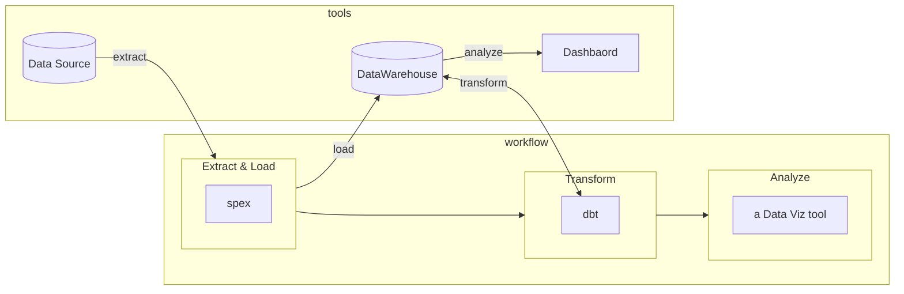
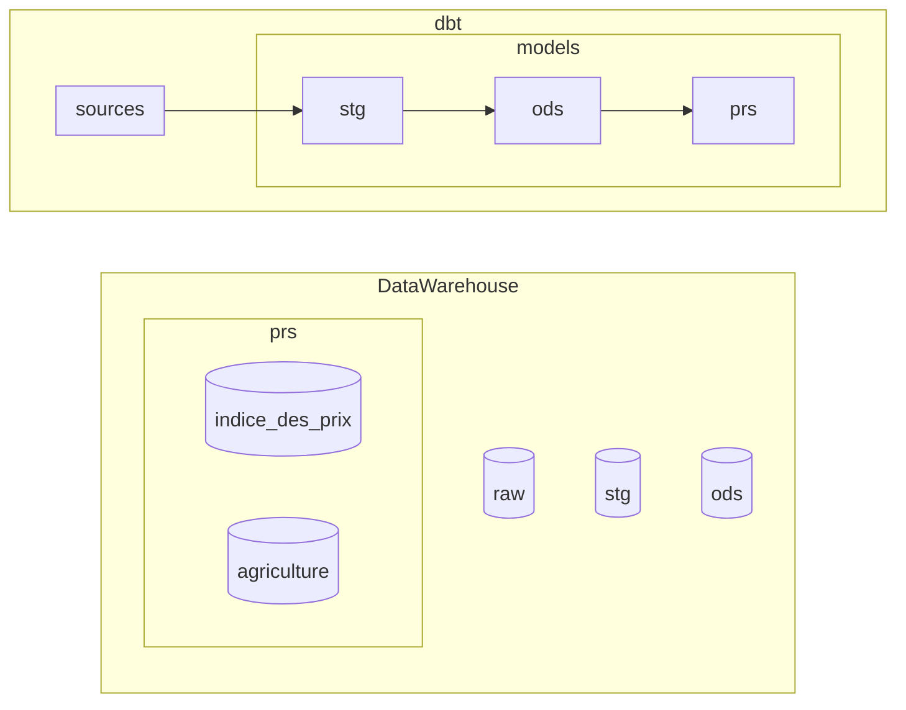

# Annuaire Statistique du Maroc

- **Name of the dbt project** : `annuaire_statistique`
- **Database used** : DuckDB

## Contents
* [Workflow](#workflow)
* [Loading the data](#loading-the-data)
* [Visualise Data stored in the DataWarehouse](#visualise-data-stored-in-the-datawarehouse)
* [DataWarehouse layers](#datawarehouse-layers)
* [Develop with dbt](#develop-with-dbt)
    + [Sources in `raw`](#sources-in--raw-)
    + [Staging tables in `stg`](#staging-tables-in--stg-)
    + [Dimensions & Facts tables in `ods`](#dimensions---facts-tables-in--ods-)
    + [Wide tables in `prs`](#wide-tables-in--prs-)
* [Manage the dbt project](#manage-the-dbt-project)
    + [dbt settings](#dbt-settings)
    + [dbt dependencies](#dbt-dependencies)
    + [Generate Sources descriptions `.yaml`](#generate-sources-descriptions-yaml)
    + [(Optional) Describe dbt tables with `.yml` files](#optional-describe-dbt-tables-with-yml-files)
    + [Access Data Catalog](#access-data-catalog)
    
* [Useful Resources:](#useful-resources-)

## Workflow


## Loading the data
The data is located in the `dwh_data` folder. It contains : 

## DataWarehouse layers

In **dbt** :
- we define raw data in sources `.yml` files 
- we write queries in `.sql` files

When we run dbt, it creates tables in the **DataWarehouse**.

The DataWarehouse is composed of several schemas, mapped to the subfolder structure of the `models` folder.
The schemas/subfolders represent the steps in the transformation workflow :



1. **raw** : Where raw data is located. dbt use *raw* tables as *dbt sources* to create *stg* dbt models. See [Sources in `raw`](#sources-in-raw).
2. **stg** : Where data is **st**a**g**ed. We rename and recast sources columns. See [Staging tables in `stg`](#staging-tables-in-stg)
3. **ods** : Where data is transformed into entities (dimensions & facts). See [Dimensions & Facts tables in `ods`](#dimensions--facts-tables-in-ods)

## Develop with dbt

### Sources in `raw`
A `.yml` file must be created in the `/models/raw` folder. It contains a `source` definition, describing a source table in the `raw` schema of the DataWarehouse.

You don't have to write its content, you can  [Generate Sources descriptions `.yaml`](#generate-sources-descriptions-yaml)

### Staging tables in `stg`
Once you defined [Sources in `raw`](#sources-in-raw) :
1. Create a `.sql` file in the `/models/stg` folder. In this file, write a SQL query on a source table in order to **Rename** & **Recast** columns.
2. Run the dbt model to create the table in the Data Warehouse.
3. [(Optional) Describe dbt tables with `.yml` files](#optional-describe-dbt-tables-with-yml-files)

### Dimensions & Facts tables in `ods`
Once you [Staged tables in `stg`](#staging-tables-in-stg) :
1. Create a `.sql` file in the `/models/ods` folder. In this file, write a SQL query on `stg` tables in order to create a functional entity.
2. Run the dbt model to create the table in the Data Warehouse.
3. [(Optional) Describe dbt tables with `.yml` files](#optional-describe-dbt-tables-with-yml-files)

### Wide tables in `prs`
Once you created [Dimensions & Facts tables in `ods`](#dimensions--facts-tables-in-ods) :
1. Create a `.sql` file in the `/models/prs/...` folder (see the 4th points in [DataWarehouse Layers](#datawarehouse-layers)). In this file, write a SQL query on `ods` tables in order to create a Wide table with all information you need from Dimension & Fact tables.
2. Run the dbt model to create the table in the DataWarehouse.
3. [(Optional) Describe dbt tables with `.yml` files](#optional-describe-dbt-tables-with-yml-files)

## Manage the dbt project

### dbt settings
All settings are described in the [`dbt_project.yml`](dbt_project.yml).
A lot of them are set automatically by dbt, except the `Models configuration` section which defines the Materialization (`table`,`view`,...) and the schema (`stg`, `ods`, `prs`) for dbt models depending on their location the `/models` folder.

See [dbt documentation on `dbt_project.yml`](https://docs.getdbt.com/reference/dbt_project.yml)

### dbt dependencies
dbt relies on packages to work (for instance `dbt-codegen` to generate code).
The packages are defined in [`packages.yml`](packages.yml).

To install dbt dependencies, run
```
dbt deps
```

### Generate Sources descriptions `.yaml`
For this to work :
- Make sure the table exists in the Data Warehouse, in the `raw` schema
- Make sure you install [dbt dependencies](#dbt-dependencies)

Run the following code to generate the dbt Source definition of a table *(replace `SOURCE_NAME` by the name of your source table)*
```
dbt run-operation generate_source --args '{"schema_name": "raw", "generate_columns": "true", "include_descriptions":"true", "table_names":["SOURCE__TABLE_NAME"], "name":"inform"}'
```

If you need to merge what has been generated with an existing file, make sure you don't repeat the fields like `version:` and `sources:`

See [dbt documentation on sources](https://docs.getdbt.com/docs/build/sources).

### (Optional) Describe dbt tables with `.yml` files
Run the following code in the terminal to generate the content of the `.yml` file for a table *(replace `TABLE_NAME` by the name of your model)*
```
dbt run-operation generate_model_yaml --args '{"model_names": ["TABLE_NAME"], "upstream_descriptions":"true"}'
```

If you need to merge what has been generated with an existing file, make sure you don't repeat the fields like `version:` and `models:`

See [dbt documentation on Model properties](https://docs.getdbt.com/reference/model-properties)


### Access Data Catalog
1. Generate assets for the website :
```
dbt docs generate
```
2. Run the website server :
```
dbt docs serve
```
3. Access the website with the VSCode pop-up

## Useful Resources:
- Learn more about dbt [in the docs](https://docs.getdbt.com/docs/introduction)
